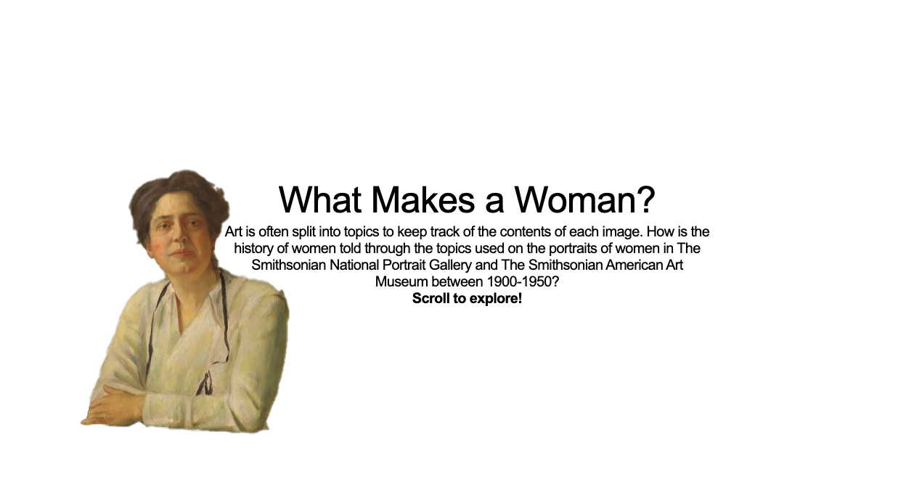
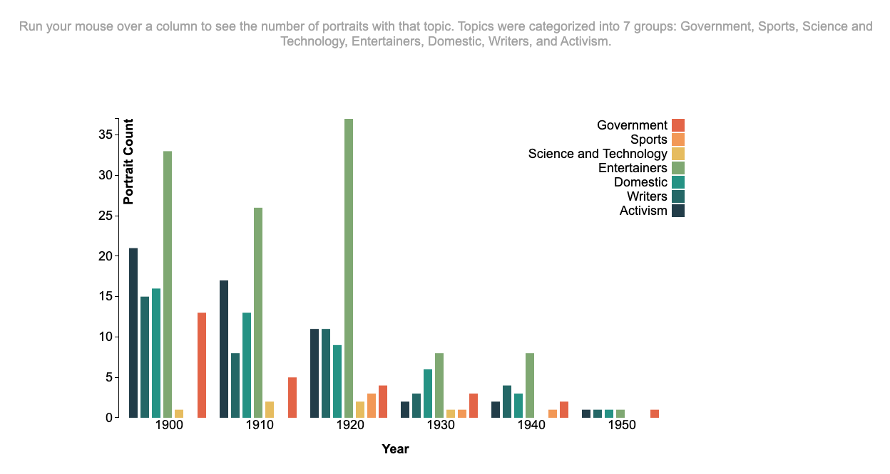
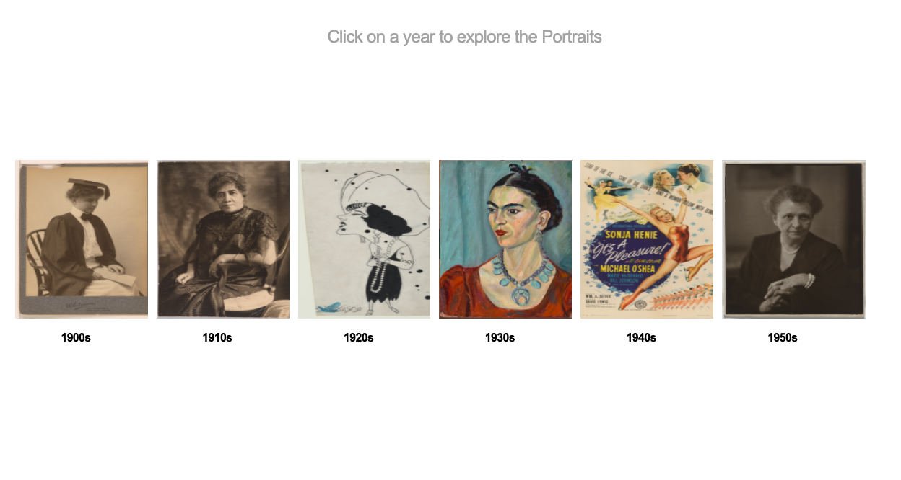

# What Makes a Woman?
### Description
For this visualization I wanted to show how woman in the Smithsonian are represented through the topics they are tagged with. I looked at the portraits of women in The National Portrait Gallery. I chose to look at portraits because historically portraits were only painted of prominent figures and I wanted to see what women were classified as important enough to have a portrait made of them and why.

The visualization is split up into a graph showing a count of the number of portraits with each topic and a gallery of portraits showing the portraits from each year represented. 

For the graph, I split topics into 7 categories. These categories are Science and Technology, Government, Writers, Domestic, Sports, Entertainment, and Activism. I grouped topics pertaining to this categories into these 7 areas. I grouped Health and Wellness into the Science and Technology category and Government consists of women who worked in government and first ladies. 

## Iteration 1

## Iteration 2
I have included screen shots below. The first shows the home page and the second and third show the graph and the portrait gallery.

Changes made from iteration 1:
* The graph now counts for portraits, not for topics. So, as before each individual topic in a category was counted, now each portrait is only counted once per category even if it has multiple tags from one category.
* I added portraits from The Smithsonian American Art Museum as well to have a bigger dataset
* I added the portrait gallery so the user can see all of the portraits from the graph

## Iteration 3
My final iteration of this project is a sample of a full analysis of portraits in the National Portrait Gallery from 1900-2010. I decided to expand the dates from my previous iteration after much comment on seeing the full picture.

For this iteration I am just looking at the topics: Society and social change, Science and Technology, Government, Writers, Domestic, Sports, and Entertainment. In order to see the complete story of portrait representation I had to abandon the API and look at the Smithsonian Collections Search Center. I got my topic count by using the query All Records / Dates: 1900s - 2010s / online media:"Images" / catalog record source:"National Portrait Gallery" / topic:"Women" / topic:"Portraits" and looking by year at the different topics.

The images are also a sample containing all of the non copyrighted images I could get from the API and a sample of 3 randomly chosen portraits from 1960, 1970, 1980, 1990, and 2000/2010.

A finalized version of this project would include a system like before where all topics are counted and recorded and split into categories. As it is now, some topics are not counted where they should be, such as congresswomen in the government category and artists in the entertainers category. It would also include all of the images of the portraits of women. As of now, there is only a small sample of the 2,132 portraits. 

The final prototype can be found at https://isabelstoddart.github.io/MS1QuantitativeData/
