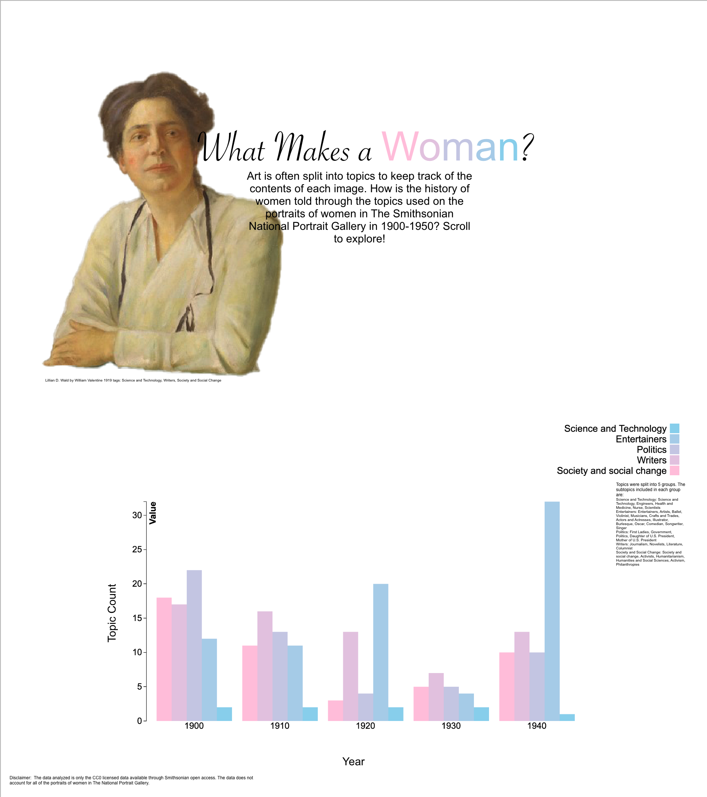
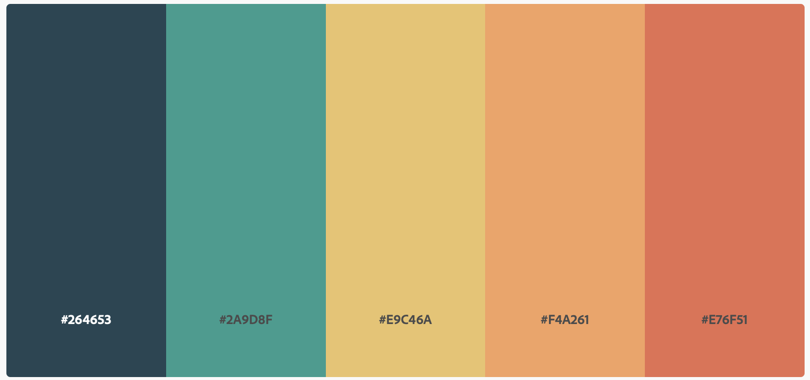

# What Makes a Woman?
### Description
For this visualization I wanted to show how woman in the Smithsonian are represented through the topics they are tagged with. I looked at the portraits of women in The National Portrait Gallery and The Smithsonian American Art Museum. I chose to look at portraits because historically portraits were only painted of prominent figures and I wanted to see what women were classified as important enough to have a portrait made of them and why.

I decided to only analyze portraits in the years 1900-1950. I narrowed down on these dates so I would be looking at 20 years before the 19th Amendment was passed and about 20 years after. I wanted to see the change that occured before and after the women's rights movement.

The visualization is split up into a graph showing a count of the number of portraits with each topic and a gallery of portraits showing the portraits from each year represented. 

For the graph, I split topics into 7 categories. These categories are Science and Technology, Government, Writers, Domestic, Sports, Entertainment, and Activism. I grouped topics pertaining to this categories into these 7 areas. I grouped Health and Wellness into the Science and Technology category and Government consists of women who worked in government and first ladies. 

## Iteration 1
### High Fidelity Prototype

### Dataset used
topicsDataReformattedHardcoded.json

### Color Scheme Change
I changed the color scheme after multiple comments that my original choice was biased. I decided on a more neutral palette. The new color palette is:

### Things to Note
* Topics were split into 5 main groups (Science and Technology, Entertainers, Politics, Writers, and Society and Social Change). I only looked at topics pertaining to woman’s careers. I filtered out topics about the background of the image (i.e. chair, flowers) or the woman’s appearance (i.e. necklace, costume).
* Most of the politics topics pertain to women whose husbands work in politics, however I decided to still look at this genre because being a First Lady is still a career.
* The data analyzed is only the CC0 licensed data available through Smithsonian open access. The data does not account for all of the portraits of women in The National Portrait Gallery.
* I chose the dates 1900-1940 primarily because of the small set of data that is CC0 licensed. I took what I had to work with and then chose those takes secondly because it gives time before and after the women’s suffrage movement.
* There are 182 portraits analyzed overall

### Findings
* There are a lot of portraits with entertainer topics throughout the years (except for 1930 where this number is low)
* Society and social change topics are high in 1900 and 1910 which may be because of the women’s suffrage movement
* The number of entertainer topics are high in the 1920s which may be because of the roarings 20s
* The topic of science and technology is small throughout all of the years, I wonder if this would grow if there were more data on the later years (I didn’t look at later years because the data wasn’t available)
* Writers topics are really high in 1900 and then dwindle down

### Possible Explanation on Topic Variety (Something to think about):

An important thing to note is that looking beyond woman’s representation throughout the years, the national portrait gallery just might not have portraits of women in particular fields (they may be missing from the CC0 enabled data but also may be missing from the collection as a hold). So, it may go beyond women’s representation in these actual fields and be more about the collection of women’s portraits that The NPG has.

### Next Steps
* Turn prototype into interactive webpage that looks like prototype on GitHub pages
* Make path to get final dataset through code (right now it is done manually)
* Possibly add more data, look at portraits of women in other collections as well
* Possibly incorporate images into the visual so when you roll your mouse over a bar a portrait pops up. Possibly explore this for Qualitative Visualization.
* Possibly have another bar graph with subgroups pop up when you click on a bar.

## Final Iteration
The final visualization can be found at https://isabelstoddart.github.io/MS1QuantitativeData/

The final dataset used is topicsData.json

Changes made from iteration 1:
* The graph now counts for portraits, not for topics. So, as before each individual topic in a category was counted, now each portrait is only counted once per category even if it has multiple tags from one category.
* I added portraits from The Smithsonian American Art Museum as well to have a bigger dataset
* I added the portrait gallery so the user can see all of the portraits from the graph
